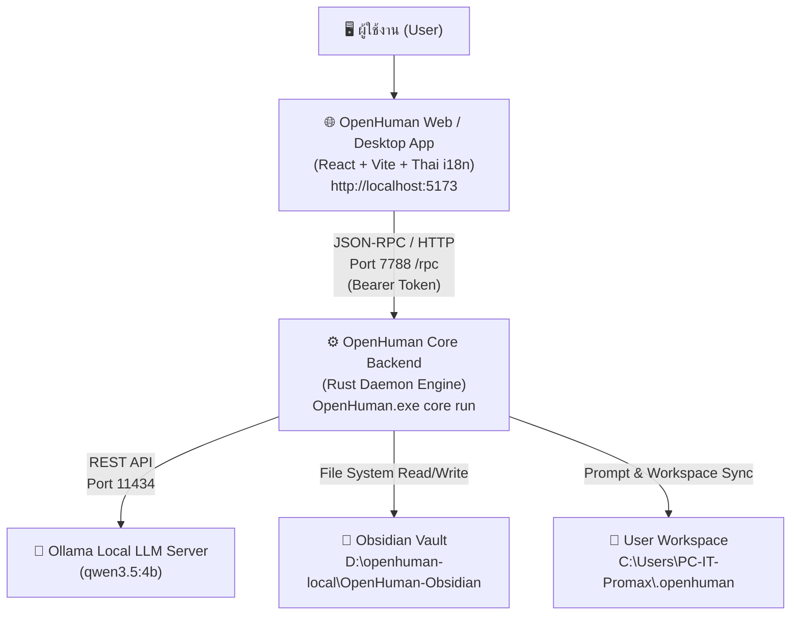

# คู่มือการติดตั้ง การตั้งค่า และสภาพแวดล้อม (.ENV) ฉบับสมบูรณ์
## OpenHuman Thai Local Edition (Ollama + Obsidian + Thai UI)

เอกสารฉบับนี้รวบรวมขั้นตอนการติดตั้ง การกำหนดค่าคอนฟิก (.ENV) พารามิเตอร์ระบบ และวิธีเริ่มต้นใช้งาน OpenHuman ภาษาไทยแบบ Local 100% บนระบบปฏิบัติการ Windows

---

## 📌 1. ภาพรวมสถาปัตยกรรมระบบ (Architecture Overview)



---

## 🛠️ 2. สิ่งที่จำเป็นต้องติดตั้งล่วงหน้า (Prerequisites)

| รายการ | เวอร์ชันที่แนะนำ | หน้าที่ | วิธีตรวจสอบ |
| :--- | :--- | :--- | :--- |
| **Node.js** | v20.x หรือ v24.x LTS | รัน Frontend Vite Dev Server / Build | `node -v` |
| **pnpm** | v9.x+ | Package Manager สำหรับจัดการ Dependencies | `pnpm -v` |
| **Ollama** | Latest Windows | ให้บริการ Local LLM Model แบบออฟไลน์ | `ollama --version` |
| **Obsidian** | Latest Windows | แอพจัดการคลังความรู้ (Personal Knowledge Vault) | เปิดโปรแกรม Obsidian |
| **OpenHuman Core** | v0.63.12+ | ตัวประมวลผลหลัก (Rust Core Engine) | `OpenHuman.exe --version` |

---

## ⚙️ 3. การกำหนดค่าตัวแปรสภาพแวดล้อม (.ENV & Configuration)

### 3.1 ตัวแปรระดับระบบ / Backend Core (`.env`)
กำหนดในไฟล์ `.env` ที่ Root Folder (`D:\openhuman-local\.env`) หรือตั้งผ่านคำสั่งเรียกโปรแกรม:

```env
# ========================================================
# OPENHUMAN CORE & SECURITY CONFIGURATION
# ========================================================

# รหัสยืนยันความปลอดภัยสำหรับ JSON-RPC ระหว่าง Frontend และ Core
OPENHUMAN_CORE_TOKEN=openhuman-local-token-12345

# พอร์ตของ Core Service
OPENHUMAN_CORE_PORT=7788

# โหมดนำ Core เดิมที่รันอยู่มาใช้ต่อ (ป้องกันปัญหา Core ชนกัน)
OPENHUMAN_CORE_REUSE_EXISTING=1

# ========================================================
# AGENT DIRECTORIES & WORKSPACE
# ========================================================

# พื้นที่ทำงานของ Agent (ชี้ไปยัง Obsidian Vault)
OPENHUMAN_ACTION_DIR=D:\openhuman-local\OpenHuman-Obsidian

# โฟลเดอร์เก็บสถานะ Memory, Sessions, Database ของ User
OPENHUMAN_WORKSPACE_DIR=C:\Users\PC-IT-Promax\.openhuman\users\6a8a603d6118dae0642995eb\workspace

# ========================================================
# LOCAL AI (OLLAMA) CONFIGURATION
# ========================================================

# ที่อยู่เซิร์ฟเวอร์ Ollama
OLLAMA_BASE_URL=http://localhost:11434

# โมเดลเริ่มต้นสำหรับการสนทนาภาษาไทย
OLLAMA_DEFAULT_MODEL=qwen3.5:4b

# โหมดความปลอดภัยของคำสั่ง (readonly, supervised, full)
OPENHUMAN_AUTONOMY_LEVEL=supervised
```

---

### 3.2 ตัวแปรฝั่ง Frontend UI (`app/.env.local`)
สร้างไฟล์ `app/.env.local` ในโฟลเดอร์ `D:\openhuman-local\app/.env.local`:

```env
# URL สำหรับเชื่อมต่อไปยัง Core JSON-RPC
VITE_CORE_RPC_URL=http://127.0.0.1:7788/rpc

# กำหนดภาษาเริ่มต้นเป็นภาษาไทย
VITE_DEFAULT_LOCALE=th

# ปิดระบบ Telemetry ภายนอกเพื่อความเป็นส่วนตัว
VITE_TELEMETRY_DISABLED=true
```

---

## 📝 4. ไฟล์กำหนดสไตล์และพฤติกรรมของ Agent (Agent Prompt Files)

ไฟล์เหล่านี้ถูกเก็บไว้ใน Workspace (`C:\Users\PC-IT-Promax\.openhuman\users\6a8a603d6118dae0642995eb\workspace\`) เพื่อบังคับให้ Agent ทุกตัวตอบเป็นภาษาไทย:

### 4.1 ไฟล์ `USER.md` (โปรไฟล์ผู้ใช้งาน)
```markdown
# User Profile

- **Preferred Language**: Thai (ภาษาไทย)
- **Primary Instruction**: You MUST ALWAYS communicate, converse, and reply in fluent and natural Thai (ภาษาไทย).
- **Communication Style**: เป็นมิตร สุภาพ กระชับ ชัดเจน และเป็นธรรมชาติ
```

### 4.2 ไฟล์ `AGENTS.md` (คำสั่งสากลสำหรับทุก Agent)
```markdown
# Global Agent Instructions

## Language
- Always reply in Thai (ภาษาไทย).
- All explanations, summaries, and chat responses must be written in clear, natural Thai.
- You may use English for technical terms, code snippets, or file paths where appropriate, but the conversation and surrounding text must be Thai.
```

### 4.3 ไฟล์ `STYLE.md` (รูปแบบภาษาและการเขียน)
```markdown
# Writing style

Reply like you're texting a friend: casual, lowercase-ok, natural. Lead with the answer, then whatever context actually helps.

Language rule: Always respond in fluent, natural Thai (ภาษาไทย).

Two hard rules: no em-dashes (—), use commas or short sentences instead. Don't repeat yourself.
```

---

## 🚀 5. สคริปต์เปิดใช้งานอัตโนมัติในคลิกเดียว (One-Click Launcher)

ไฟล์สคริปต์ `D:\openhuman-local\Start-OpenHuman-Thai.bat` ทำหน้าที่เปิด Service ทุกส่วนพร้อมกัน:

```bat
@echo off
chcp 65001 >nul
title OpenHuman Thai Launcher
echo ========================================================
echo        🚀 กำลังเริ่มการทำงาน OpenHuman (ภาษาไทย)
echo ========================================================
echo.

cd /d "D:\openhuman-local"

echo [1/3] ตรวจสอบสถานะ Ollama Server...
curl -s http://localhost:11434/api/tags >nul 2>&1
if %errorlevel% neq 0 (
    echo [*] กำลังเริ่มทำงาน Ollama...
    start /b "" ollama serve >nul 2>&1
    timeout /t 2 /nobreak >nul
)
echo [OK] Ollama พร้อมทำงาน (qwen3.5:4b)

echo.
echo [2/3] ตรวจสอบ OpenHuman Core Service...
curl -s http://127.0.0.1:7788/rpc >nul 2>&1
if %errorlevel% neq 0 (
    if exist "C:\Users\PC-IT-Promax\AppData\Local\OpenHuman\OpenHuman.exe" (
        echo [*] กำลังเปิด Core Service (พอร์ต 7788)...
        set OPENHUMAN_CORE_TOKEN=openhuman-local-token-12345
        start /b "" "C:\Users\PC-IT-Promax\AppData\Local\OpenHuman\OpenHuman.exe" core run --port 7788 >nul 2>&1
        timeout /t 3 /nobreak >nul
    )
)
echo [OK] Core Service พร้อมทำงาน

echo.
echo [3/3] กำลังเปิดหน้าต่าง OpenHuman ภาษาไทย (Desktop App)...
start /b "" cmd /c "pnpm --filter openhuman-app dev --port 5173" >nul 2>&1
timeout /t 2 /nobreak >nul

if exist "C:\Program Files (x86)\Microsoft\Edge\Application\msedge.exe" (
    start "" "C:\Program Files (x86)\Microsoft\Edge\Application\msedge.exe" --app=http://localhost:5173 --window-size=1280,900
) else if exist "C:\Program Files\Google\Chrome\Application\chrome.exe" (
    start "" "C:\Program Files\Google\Chrome\Application\chrome.exe" --app=http://localhost:5173 --window-size=1280,900
) else (
    start http://localhost:5173
)

echo.
echo ========================================================
echo   ✅ เปิด OpenHuman ภาษาไทย เรียบร้อยแล้ว!
echo ========================================================
timeout /t 3 >nul
exit
```

---

## 🔑 6. ข้อมูลการกรอกในหน้าแรก (First-time Connection Parameters)

เมื่อเปิดหน้าจอแอปขึ้นมาครั้งแรก (BootCheckGate Screen):

| รายการ | ค่าที่ต้องกรอก |
| :--- | :--- |
| **Runtime URL** | `http://127.0.0.1:7788/rpc` |
| **Auth Token** | `openhuman-local-token-12345` |
| **ขั้นตอน** | กดปุ่ม **"Test Connection"** (จะขึ้นสีเขียว) ➔ กด **"Continue"** |

---

## 🎛️ 7. การตั้งค่าโมเดล AI ในหน้าแอปพลิเคชัน (In-App AI Settings)

เข้าไปที่ **Settings (การตั้งค่า)** ➔ **AI Models & Providers**:
1. **Local Provider**: เลือก `Ollama`
2. **Endpoint URL**: `http://localhost:11434`
3. **Chat Model**: `qwen3.5:4b`
4. **Embeddings Model**: `nomic-embed-text` (หรือ `qwen3.5:4b`)
5. **Autonomy Tier**: เลือก `Supervised` (ขอการยืนยันก่อนรันคำสั่งสำคัญ) หรือ `Full` (ทำงานอัตโนมัติ)
6. **Action Directory**: `D:\openhuman-local\OpenHuman-Obsidian`

---

## 🔄 8. คำสั่งสำหรับพัฒนาและทดสอบ (Development Commands)

รันจากโฟลเดอร์ `D:\openhuman-local`:

```bash
# ติดตั้ง dependencies ทั้งหมด
pnpm install

# รันหน้าจอพัฒนา Vite Frontend (พอร์ต 5173)
pnpm dev

# ตรวจสอบความถูกต้องของ Typescript
pnpm typecheck

# คอมไพล์ Production Bundle
pnpm build

# ตรวจสอบสถานะ Ollama ในเครื่อง
ollama list
```
