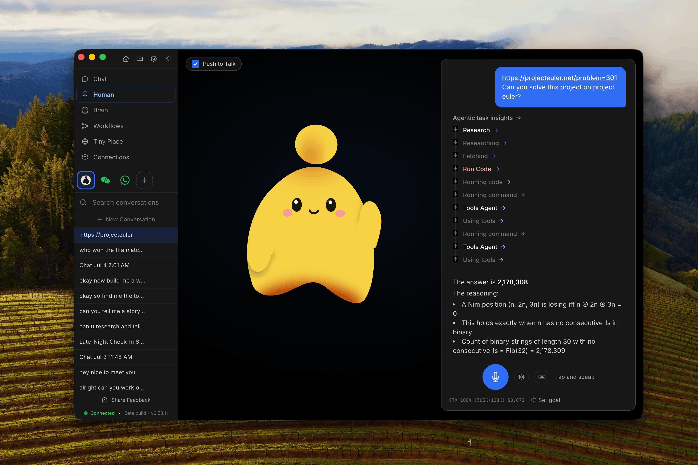

<h1 align="center">OpenHuman</h1>

<p align="center">
  
</p>

<p align="center">
  <a href="https://discord.tinyhumans.ai/">Discord</a> •
  <a href="https://www.reddit.com/r/tinyhumansai/">Reddit</a> •
  <a href="https://x.com/intent/follow?screen_name=tinyhumansai">X/Twitter</a> •
  <a href="https://tinyhumans.gitbook.io/openhuman/">Docs</a>
</p>

<p align="center">
  
  <a href="https://github.com/tinyhumansai/openhuman/releases/latest"></a>
</p>

## Overview

OpenHuman is an open-source desktop agent platform for private, local-first AI workflows. It combines a Rust-powered core, a Tauri desktop shell, and a React UI to help users connect data sources, maintain persistent context, and execute intelligent tasks with a polished, human-friendly interface.

This repository contains the OpenHuman core and desktop application source code. The product targets desktop environments on macOS, Linux, and Windows.

## Quick Start

Install from the website or run one of the commands below.

### macOS / Linux x64

```bash
curl -fsSL https://raw.githubusercontent.com/tinyhumansai/openhuman/main/scripts/install.sh | bash
```

### Windows

```powershell
irm https://raw.githubusercontent.com/tinyhumansai/openhuman/main/scripts/install.ps1 | iex
```

For full installation details, visit: https://tinyhumans.ai/openhuman

## Key Features

- **Desktop-first agent experience:** fast onboarding, clear workflows, and a polished UI.
- **Persistent local memory:** structured Memory Tree summaries stored in SQLite and exported to an Obsidian-compatible vault.
- **Integrated connectors:** 118+ OAuth integrations for Gmail, Notion, GitHub, Slack, Stripe, Calendar, Drive, Linear, Jira, and more.
- **Auto-fetch synchronization:** active integrations refresh on a regular loop so the agent keeps current context automatically.
- **Model routing:** tasks are routed to the right model for reasoning, speed, or vision.
- **Native tools:** built-in search, web scraping, code operations, voice, and task-specific capabilities.
- **Token compression:** TokenJuice reduces prompt size before model calls to save cost and latency.
- **Privacy and security:** workflow data stays local, encrypted, and under user control.

## Why OpenHuman

OpenHuman is designed to minimize vendor fragmentation and keep workflow context on device. It focuses on:

- preserving memory beyond single chat sessions,
- delivering a desktop-first user experience,
- enabling easy integration with external tools and services,
- and maintaining user control over data.

## Developer Resources

If you are contributing or exploring the codebase, begin with these resources:

- [Architecture](https://tinyhumans.gitbook.io/openhuman/developing/architecture)
- [Getting Set Up](https://tinyhumans.gitbook.io/openhuman/developing/getting-set-up)
- [Cloud Deploy](https://tinyhumans.gitbook.io/openhuman/developing/cloud-deploy)
- [`CONTRIBUTING.md`](./CONTRIBUTING.md)

## OpenHuman Compared

A high-level comparison of OpenHuman and similar agent harnesses.

| Feature | OpenHuman | Typical alternative |
| --- | --- | --- |
| Open-source | ✅ GNU | often proprietary or MIT |
| Desktop-first | ✅ polished UI | often terminal-first |
| Persistent memory | ✅ Memory Tree + vault | chat-scoped or plugin-dependent |
| Connector sync | ✅ auto-fetch | usually manual or plugin-based |
| Model routing | ✅ built in | often manual |
| Native tools | ✅ search, scraper, voice, code | usually code-only |

## Star the Project

If you find this project useful, please star the repository on GitHub.

## Contributors

Thank you to everyone who contributes. For contributor guidelines, see [`CONTRIBUTING.md`](./CONTRIBUTING.md).

<a href="https://github.com/tinyhumansai/openhuman/graphs/contributors">
  
</a>
