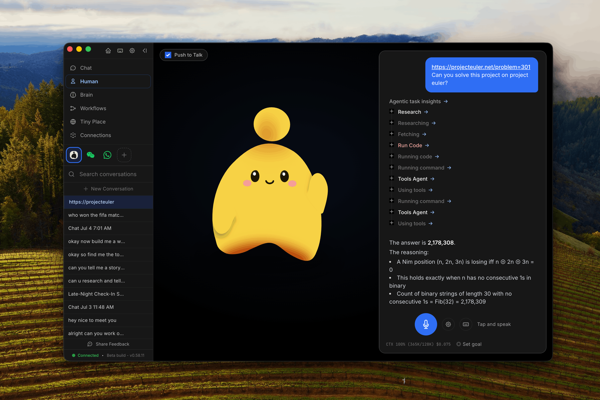
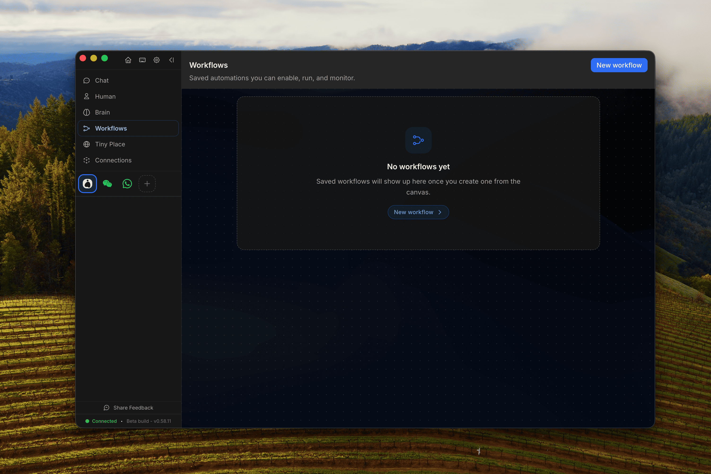

<h1 align="center">OpenHuman</h1>

<p align="center">
 
</p>

<p align="center" style="display: inline-block">
	<a href="https://trendshift.io/repositories/23680" target="_blank" style="display: inline-block">
		
	</a>
	<a href="https://www.producthunt.com/products/openhuman?embed=true&amp;utm_source=badge-top-post-badge&amp;utm_medium=badge&amp;utm_campaign=badge-openhuman" target="_blank" rel="noopener noreferrer">
		
		</a>
		<a href="https://www.producthunt.com/products/openhuman?embed=true&amp;utm_source=badge-top-post-badge&amp;utm_medium=badge&amp;utm_campaign=badge-openhuman" target="_blank" rel="noopener noreferrer">
			
		</a>
</p>
<p align="center" style="display: inline-block">
 <a href="https://www.producthunt.com/products/openhuman?embed=true&amp;utm_source=badge-top-post-topic-badge&amp;utm_medium=badge&amp;utm_campaign=badge-openhuman" target="_blank" rel="noopener noreferrer">
  
  </a>
  <a href="https://www.producthunt.com/products/openhuman?embed=true&amp;utm_source=badge-top-post-topic-badge&amp;utm_medium=badge&amp;utm_campaign=badge-openhuman" target="_blank" rel="noopener noreferrer">
   
   </a>
 </p>

<p align="center">
 <strong>An open-source agent harness with a Rust core: lightweight, modular, and pluggable into whatever LLM, memory, or search engine you already run.</strong>
</p>

<p align="center">
 <a href="https://github.com/tinyhumansai/openhuman/discussions">Discussions</a> •
 <a href="https://guild.tinyhumans.ai/">Discord</a> •
 <a href="https://www.reddit.com/r/tinyhumansai/">Reddit</a> •
 <a href="https://x.com/intent/follow?screen_name=tinyhumansai">X/Twitter</a> •
 <a href="https://tinyhumans.gitbook.io/openhuman/">Docs</a> •
 <a href="https://x.com/intent/follow?screen_name=senamakel">Follow @senamakel (Creator)</a>
</p>

<p align="center">
  🇺🇸 <a href="./README.md">English</a> | 🇨🇳 <a href="./docs/README.zh-CN.md">简体中文</a> | 🇯🇵 <a href="./docs/README.ja-JP.md">日本語</a> | 🇰🇷 <a href="./docs/README.ko.md">한국어</a> | 🇩🇪 <a href="./docs/README.de.md">Deutsch</a> | 🇵🇰 <a href="./docs/README.ur-pk.md">اردو</a>
</p>

<p align="center">
 
 <a href="https://github.com/tinyhumansai/openhuman/releases/latest"></a>
 <a href="https://github.com/tinyhumansai/openhuman/stargazers"></a>
 <a href="./LICENSE"></a>
</p>

> **Early Beta**: Under active development. Expect rough edges.

> Within one week of launch, OpenHuman became the number one trending repository on GitHub for nine days in a row.

# Install

Download installers from [tinyhumans.ai/openhuman](https://tinyhumans.ai/openhuman?utm_source=github&utm_medium=readme) or from the [GitHub Releases](https://github.com/tinyhumansai/openhuman/releases/latest) page.

For terminal installs (Homebrew, Debian/Ubuntu `.deb`, AUR, install scripts, and platform notes), see **[INSTALL.md](./INSTALL.md)**.

# What is OpenHuman?

OpenHuman is a Rust core with a desktop app, a browser UI, a terminal client, and a Rust library wrapped around it. The same core runs all four. Every section below links to the deeper writeup in the [docs](https://tinyhumans.gitbook.io/openhuman/).

## Lightweight and fast

The core runs in-process, not as a separate daemon the UI talks to over a socket. A [fleet sweep](./gitbooks/developing/performance.md) of 50, 100, and 500 live agents in one process measured a marginal cost of 1,985, 1,866, and 1,770 KiB per additional agent, settling at 223 MiB, 356 MiB, and 1,393 MiB total. The same workload run as 500 separate processes instead of 500 agents in one costs about 48 MiB per instance, so sharing one process is roughly 25 times denser. Thousands of agents on one box is the direction this is heading, not a number we've hit yet.

A cold agent turn takes 102 ms; the full nine-phase bootstrap (config load, registry init, agent build, memory construction, first turn) takes 476 ms. A slim build settles at about 42 MiB RSS, of which roughly 15.2 MiB is private heap and the rest is paged-in executable text and allocator overhead. [Token compression](./gitbooks/features/token-compression.md) (tinyjuice) also cuts what actually reaches the model, so a large context costs less than its raw size suggests.

Full methodology and numbers: [`docs/library-benchmarking.md`](./docs/library-benchmarking.md), [`docs/harness-comparison-2026-07-22.md`](./docs/harness-comparison-2026-07-22.md), and [performance](./gitbooks/developing/performance.md).

## Modular

Cargo feature gates control what compiles in. The contributor default is nine gates (`media`, `skills`, `flows`, `mcp`, `channels`, `http-server`, `scheduler-gate`, `file-logging`, `modules`); the shipped desktop product turns on a wider set listed in `scripts/ci/product-features.txt`. Dropping everything gets a pure-slim build at 51 MiB stripped; adding back `skills` and `flows`, the recommended recipe for embedding, lands at about 60 MiB stripped; turning on every gate produces a 116 MiB unstripped binary. `scripts/kernel-floor.sh` keeps a down-only ratchet on the dependency count so the floor doesn't creep back up.

Past compile time, capability comes from loadable native modules: `tinydocs`, `tinyvoice`, `tinyjuice`, `tinyruntime`, `tinywallet`, `tinymcp`, `tinychannels`, and `tinyconnectors`, each with a small `*-bus` contract crate that defines its interface and wire types. See [`docs/library-minimal-recipe.md`](./docs/library-minimal-recipe.md) for the measured trade-offs of each gate.

## Pluggable engines

Every engine OpenHuman calls out to is chosen by config, not hardcoded:

- LLM: the managed TinyHumans route, Ollama, LM Studio, MLX, any local OpenAI-compatible server, Claude Code or the Claude Agent SDK, and 26 bring-your-own-key providers including OpenRouter, OpenAI, Anthropic, Google, Groq, Mistral, DeepSeek, Together, and Fireworks. See [local models and BYOK](https://tinyhumans.gitbook.io/openhuman/features/model-routing/local-and-byok-models).
- Embeddings: the managed Voyage-backed route, or your own Voyage, OpenAI, Cohere, Ollama, or OpenAI-compatible endpoint.
- Memory: [Memory v2](https://tinyhumans.gitbook.io/openhuman/features/memory) is Recall, Fetch and Store over a pluggable engine: TinyHumans (hosted CortexDB, signed in with your account) or your own CortexDB (endpoint and key). It stores documents (folders, files, links, GitHub, RSS, connected apps), conversations and learnings, answers questions with citations, and compiles a `context.md` brief for new chats. With neither engine, memory is off. Everything is switched under Connections > Memory.
- Web search: managed search included with a subscription, or your own key for Parallel, Brave, Querit, Exa, Tavily, or a self-hosted SearXNG instance.

Engine details: [engines](./gitbooks/developing/engines.md).

## Jev decides fast

Not every decision needs the model to generate text. [Jev](./gitbooks/developing/jev.md) is a small decision model, run through the TinyHumans System One proxy, that takes a question and a fixed set of options and returns a calibrated probability for each: pick one of these (Choice), score this (Score), or yes/no (Noul). It never writes prose.

The clearest use is [tool search](./docs/plans/jev-tool-search-baseline.md): with 215 core tools plus 1,000 Composio actions on the table and 160 test requests, plain BM25 retrieval got the right tool in its top pick 22.5% of the time and made 26 needless tool calls out of 31 tool-less requests. Retrieving the top 20 candidates by embedding and letting Jev choose among them got the right tool 62.0% of the time (66.7% in its top 3) and made 1 needless call, at a p50 of 1.5 seconds against BM25's 28 milliseconds. Letting Jev pick the Composio app family first and then the action within it pushes Composio-only accuracy to 80.3% top-1. It falls back to BM25 automatically when no TinyHumans credential is present.

Jev also drives step-by-step decisions inside the [browser tool](./crates/openhuman-core/src/modules/browser_task.rs), where a consequential action (a purchase, a send, a delete) returns `NeedsConfirmation` instead of executing.

## Workflows

[Workflows](./gitbooks/features/workflows.md) are saved, typed automation graphs, built on the open-source [tinyflows](https://github.com/tinyhumansai/tinyflows) engine. The catalog has 22 node kinds (agent calls, HTTP requests, code, conditions, loops, sub-workflows, approvals, and more), and a graph can trigger on a schedule, an app event, or manually, and can resume mid-run after a pause.

<p align="center">
 
</p>

> The agent proposes the workflow; you review it on a canvas and save it.

The difference from n8n or Zapier: you describe what you want, the agent drafts the graph, and you review and save it rather than wiring nodes by hand.

## Desktop, browser, and terminal

The same core ships three ways: a Tauri v2 and Wry desktop app for Windows, macOS, and Linux; the identical SPA running in any browser (`pnpm dev:app:web`); and a `ratatui`-based terminal client (`crates/openhuman-tui`).

## A Rust library

`openhuman-embed` is the typed facade for embedding the core directly in another Rust process: one `Runtime` per process, then any number of independent `Agent`s on it, each with its own provider, access tier, working directory, MCP servers, skills, prompt, and sandbox. This is the exact code from [`crates/openhuman-embed/README.md`](./crates/openhuman-embed/README.md):

```rust
use openhuman_embed::{Access, AgentSpec, McpServer, Provider, Runtime, Workspace};

let runtime = Runtime::builder()
    .workspace(Workspace::dir("/var/lib/my-product/openhuman"))
    .api_key("th_live_…")                     // the only credential in library mode
    .build()
    .await?;

let reviewer = runtime.agent(
    AgentSpec::new("reviewer")
        .system_prompt("You review pull requests and never edit files.")
        .access(Access::readonly())
        .skills_dir("./skills/review")        // copied into this agent's own skills root
        .action_dir("/srv/checkouts/pr-42"),
)?;

let fixer = runtime.agent(
    AgentSpec::new("fixer")
        .provider(Provider::openai_compatible("https://api.example/v1", "sk-…").model("gpt-5"))
        .access(Access::full())
        .mcp(McpServer::stdio("github", "gh-mcp", ["stdio"]))
        .action_dir("/srv/checkouts/pr-42"),
)?;

let review = reviewer.run("Summarise the risks in this change.").await?;
let fix = fixer
    .turn(format!("Address these findings:\n{}", review.reply))
    .send()
    .await?;
println!("{}", fix.reply);

// Continue a conversation with the same agent.
let again = fixer.turn("Now run the tests.").session(&fix.session_id).send().await?;
println!("{}", again.reply);
```

Details, feature-flag pass-through, and the minimal-footprint recipe: [embedding](./gitbooks/developing/embedding.md).

## One TinyHumans API key for everything

A single TinyHumans API key covers managed LLM inference (including access to the OpenRouter model catalogue), web search, embeddings, media generation, integrations, voice, and the Jev ranker. Pass it once, in code (`.api_key("th_...")`) or as `OPENHUMAN_BACKEND_API_KEY` for a headless host, and every one of those services is live. Details: [the TinyHumans API key](./gitbooks/developing/tinyhumans-api-key.md).

## Open source

OpenHuman is licensed under [GPL-3.0](./LICENSE).

## OpenHuman vs Other Agent Harnesses

High-level comparison (products evolve, so verify against each vendor). OpenHuman is built to **minimize vendor sprawl**, keep **workflow knowledge on-device**, and give the agent a **persistent memory** of your data, not only chat.

|                        | Claude Cowork     | OpenClaw          | Hermes Agent      | OpenHuman                                                                                                |
| ---------------------- | ----------------- | ----------------- | ----------------- | -------------------------------------------------------------------------------------------------------- |
| **Open-source**        | 🚫 Proprietary    | ✅ MIT            | ✅ MIT            | ✅ GNU                                                                                                   |
| **Simple to start**    | ✅ Desktop + CLI  | ⚠️ Terminal-first | ⚠️ Terminal-first | ✅ Clean UI, minutes                                                                                     |
| **Cost**               | ⚠️ Sub + add-ons  | ⚠️ BYO models     | ⚠️ BYO models     | ✅ One sub + TokenJuice                                                                                  |
| **Memory**             | ✅ Chat-scoped    | ⚠️ Plugin-reliant | ✅ Self-learning  | 🚀 Pluggable engine (hosted TinyHumans or your CortexDB), citations, `context.md` brief |
| **Integrations**       | ⚠️ Few connectors | ⚠️ BYO            | ⚠️ BYO            | 🚀 100+ OAuth · 5k+ MCP · 90k+ Skills                                                                    |
| **Source sync**        | 🚫 None           | 🚫 None           | 🚫 None           | ✅ Scheduled sync of folders, repos, feeds and apps into memory                         |
| **Orchestration**      | ⚠️ Sub-tasks      | ⚠️ Single loop    | ⚠️ Single loop    | 🚀 Agent graphs + checkpoints + E2E-encrypted A2A                                                        |
| **Workflows**          | 🚫 None           | ⚠️ Scripts        | ⚠️ Scripts        | 🚀 Visual, durable, agent-proposed, approval-gated                                                       |
| **Meetings**           | 🚫 None           | 🚫 None           | 🚫 None           | 🚀 Joins Meet/Zoom/Teams/Webex, speaks, live transcript                                                  |
| **Messaging channels** | 🚫 None           | ⚠️ A few          | ⚠️ A few          | ✅ 15 incl. native email (IMAP/SMTP)                                                                     |
| **Local-only mode**    | 🚫 Cloud-only     | ⚠️ BYO local      | ⚠️ BYO local      | ✅ One-switch enforced Privacy Mode                                                                      |
| **Observability**      | 🚫 Opaque         | ⚠️ Logs           | ⚠️ Logs           | ✅ Replayable run journals + per-call cost accounting                                                    |
| **API sprawl**         | 🚫 Extra keys     | 🚫 BYOK           | 🚫 Multi-vendor   | ✅ One account                                                                                           |
| **Model routing**      | 🚫 Single model   | ⚠️ Manual         | ⚠️ Manual         | ✅ Built-in                                                                                              |
| **Native tools**       | ✅ Code-only      | ✅ Code-only      | ✅ Code-only      | ✅ Code + search + scraper + browser + voice + media gen                                                 |

## Contributing from source

New contributor? Start with [`CONTRIBUTING.md`](./CONTRIBUTING.md) for the fork/PR workflow and local validation commands, or use the copy-paste AI-agent prompt in [`CONTRIBUTING-BEGINNERS.md`](./docs/CONTRIBUTING-BEGINNERS.md#optional--let-an-ai-coding-agent-guide-you). The short path is:

1. Install Git, Node.js 24+, pnpm 10.10.0, Rust 1.96.1 (`rustfmt` + `clippy`), CMake, Ninja, ripgrep, and the platform desktop build prerequisites.
2. Fork and clone the repo, then run `git submodule update --init --recursive` before `pnpm install` so the vendored Rust dependencies under `vendor/` (tinyagents, tinyflows, tinychannels, tinymemory, motosan-ai-oauth, ...) resolve.
3. Use `pnpm dev` for web-only UI work, `pnpm --filter openhuman-app dev:app` (macOS) or `pnpm dev:app:win` (Windows) for the desktop shell, and focused checks such as `pnpm typecheck`, `pnpm format:check`, and `cargo check -p openhuman --lib` before opening a PR.

The Rust workspace under `crates/` splits into `crates/openhuman-core` (package
`openhuman`: the core plus the `openhuman-core` CLI), `crates/openhuman-app`
(the Tauri desktop shell, built as a separate Cargo world), `crates/openhuman-embed`
(the library facade for embedding the core), `crates/openhuman-rpc` (shared RPC
contracts and client), and `crates/openhuman-tui` (the terminal client). See
[Building the Rust core](./gitbooks/developing/building-rust-core.md) and
[AGENTS.md](./AGENTS.md#repository-map) for the full layout.

Deeper docs: [Architecture](https://tinyhumans.gitbook.io/openhuman/developing/architecture) · [Getting Set Up](https://tinyhumans.gitbook.io/openhuman/developing/getting-set-up) · [Cloud Deploy](./gitbooks/features/cloud-deploy.md).

# Star us on GitHub

_Star the repo to follow the project and help others find it._

<p align="center">
 <a href="https://www.star-history.com/#tinyhumansai/openhuman&type=date&legend=top-left">
 <picture>
 <source media="(prefers-color-scheme: dark)" srcset="https://api.star-history.com/svg?repos=tinyhumansai/openhuman&type=date&theme=dark&legend=top-left" />
 <source media="(prefers-color-scheme: light)" srcset="https://api.star-history.com/svg?repos=tinyhumansai/openhuman&type=date&legend=top-left" />
 
 </picture>
 </a>
</p>

# Contributors Hall of Fame

Show some love and end up in the hall of fame. Contributors get free merch and special access to our [Discord](https://guild.tinyhumans.ai/).

<a href="https://github.com/tinyhumansai/openhuman/graphs/contributors">
 
</a>
