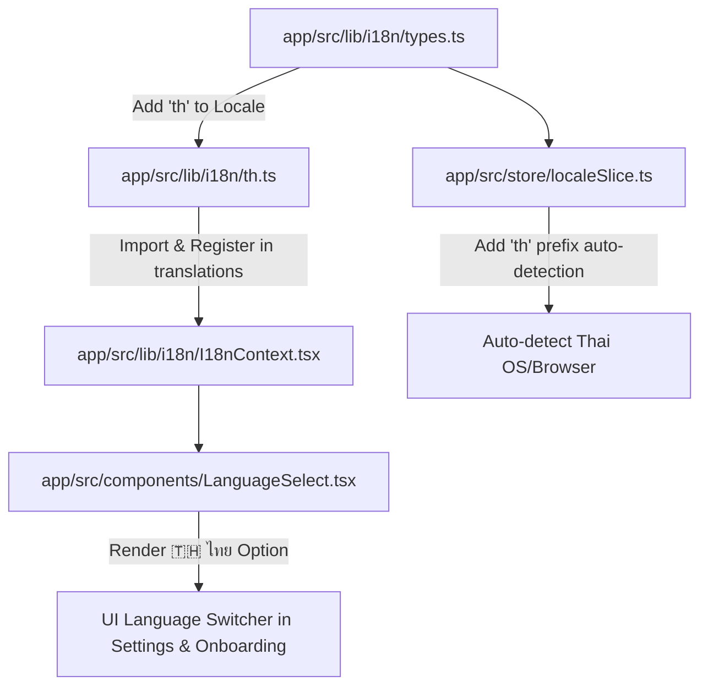
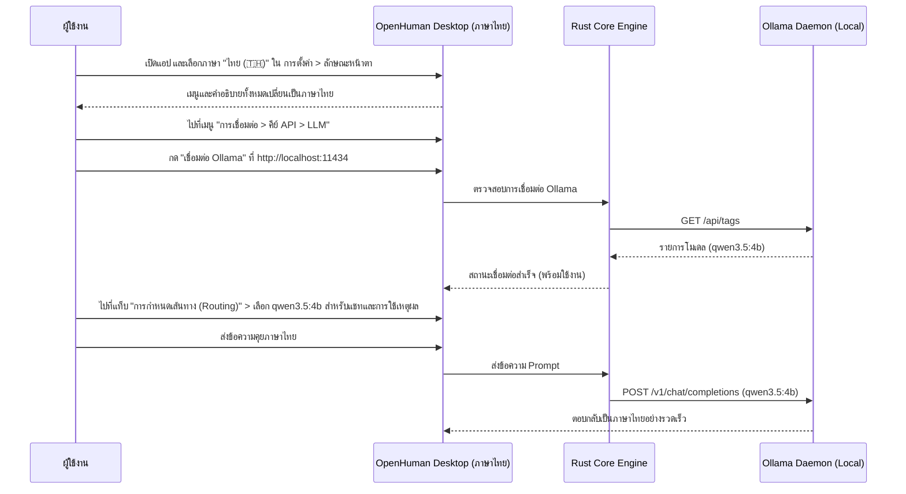

# Implementation Plan - OpenHuman Thai Localization & Ollama Setup

## Goal Description

1. Implement full **Thai Language (ภาษาไทย)** support in OpenHuman UI, covering all navigation menus, onboarding flows, settings descriptions, AI configuration panels, tool interfaces, and buttons.
2. Integrate with **Ollama** on the local Windows host using the **`qwen3.5:4b`** model, allowing both the UI and AI conversational responses to operate seamlessly in Thai.

---

## 1. Architecture of Thai Localization in OpenHuman



---

## 2. Proposed Code Changes for Thai Support

### Component: `app/src/lib/i18n` (Localization Core)

#### [MODIFY] `app/src/lib/i18n/types.ts`

- Add `'th'` to the `Locale` union type.

```typescript
export type Locale =
  | "en"
  | "th" // [NEW] Thai
  | "zh-CN"
  | "hi"
  | "es"
  | "ar"
  | "fr"
  | "bn"
  | "pt"
  | "de"
  | "ru"
  | "id"
  | "it"
  | "ko"
  | "pl";
```

#### [NEW] `app/src/lib/i18n/th.ts`

- Create a complete Thai translation map mirroring `en.ts` with natural and professional Thai terminology for:
  - **แถบเมนูและการนำทาง (Navigation & Sidebar)**: แชท (Chat), สมองและความจำ (Brain & Memory), เวิร์กโฟลว์ (Workflows), การเชื่อมต่อ (Connections), การตั้งค่า (Settings)
  - **การตั้งค่า AI & โมเดล (AI & LLM Settings)**: ผู้ให้บริการคลาวด์ (Cloud Providers), ผู้ให้บริการในเครื่อง (Local AI / Ollama), การกำหนดเส้นทางโมเดล (Workload Routing), โหมดความเป็นส่วนตัว (Privacy Mode)
  - **ระบบช่วยเหลือและการอนุมัติ (Approval Gate & Tools)**: คำขออนุมัติการทำงาน, การดำเนินการกับไฟล์, คำสั่ง Terminal
  - **คู่มือและการติดตั้งเริ่มต้น (Onboarding)**: ยินดีต้อนรับ, กำหนดค่าเริ่มต้น, ทดสอบโมเดล

#### [MODIFY] `app/src/lib/i18n/I18nContext.tsx`

- Import `th` from `./th` and add `th` to the `translations` registry map.

#### [MODIFY] `app/src/store/localeSlice.ts`

- Add `['th', 'th']` to `PREFIX_TO_LOCALE` so users running Thai Windows/Browser automatically see the app in Thai.

#### [MODIFY] `app/src/components/LanguageSelect.tsx`

- Add `{ value: 'th', flag: '🇹🇭', label: 'ไทย' }` to `LOCALE_OPTIONS` for manual switching in Settings / Appearance.

#### [MODIFY] `app/src/lib/i18n/__tests__/coverage.test.ts`

- Add `'th'` to `LOCALES` array to ensure translation keys coverage tests pass cleanly.

---

## 3. End-to-End Workflow with Ollama (`qwen3.5:4b`)



---

## 4. Verification Plan

### Automated Verification

- Run `pnpm test` on `app/src/lib/i18n/__tests__/coverage.test.ts` to ensure 100% key parity with English.
- Run `pnpm typecheck` to confirm type compatibility across all components.

### Manual UI Verification

1. **Language Selection**: Open OpenHuman Settings → Appearance → Switch Language to **"ไทย"** and verify that UI strings, menu labels, tooltips, and settings descriptions update to Thai.
2. **Ollama Integration**: Navigate to **การเชื่อมต่อ → LLM**, connect Ollama, select `qwen3.5:4b`, and verify status is **"พร้อมใช้งาน (Ready)"**.
3. **Chat Test**: Ask questions in Thai (e.g. "สวัสดีครับ ช่วยสรุปความสามารถของคุณให้ฟังหน่อย") and verify coherent Thai output from `qwen3.5:4b`.
