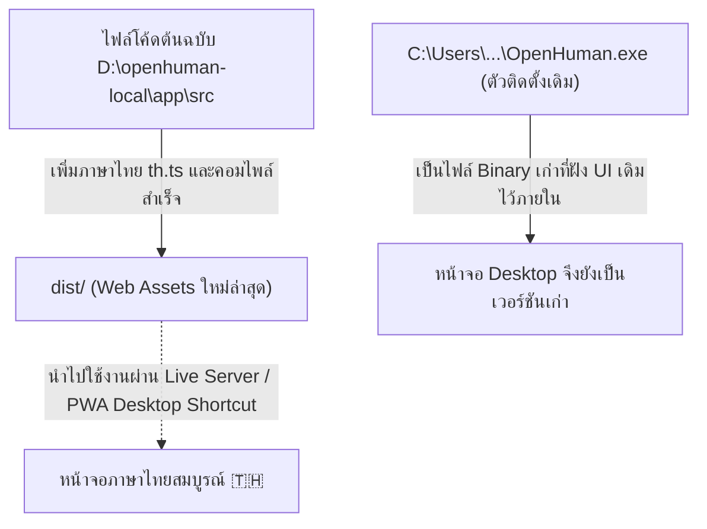

# แผนการเปิดใช้งานและปรับปรุงระบบให้แสดงผลภาษาไทยบนหน้าจอ OpenHuman

## 1. สาเหตุที่หน้าจอ `OpenHuman.exe` เดิมยังไม่แสดงภาษาไทย

1. **`OpenHuman.exe` ที่ติดตั้งไว้ในเครื่อง** (`C:\Users\PC-IT-Promax\AppData\Local\OpenHuman\OpenHuman.exe`) เป็นไฟล์ไบนารีที่คอมไพล์ไว้ล่วงหน้าตั้งแต่วันที่ 7/8/2569 ซึ่งฝังไฟล์หน้าจอ (UI Bundle) เก่าไว้ภายในตัวไฟล์ `.exe`
2. **ไฟล์ภาษาไทยที่เราพัฒนาขึ้น (`th.ts`)** อยู่ในโฟลเดอร์ Source Code `D:\openhuman-local` และเราได้ทำการติดตั้ง dependencies (`pnpm install`) และสั่ง Build แพ็กเกจสำเร็จเรียบร้อยแล้ว (`app/dist/`)
3. เมื่อเปิด `OpenHuman.exe` เดิม ตัวโปรแกรมจึงยังเรียกไฟล์ UI เก่าที่ฝังอยู่ในตัว `.exe` แทนที่จะเป็นไฟล์โค้ดใหม่ที่เราเพิ่งแก้ไข

---

## 2. ทางเลือกและแนวทางดำเนินการแก้ไข

### 🌟 แนวทางที่ 1 (แนะนำ - ใช้งานได้ทันทีและสมบูรณ์แบบที่สุด): เปิดใช้งานผ่าน Web Application / Desktop PWA Shortcut

- **หลักการทำงาน:** รันระบบ Frontend Live Server บนพอร์ตในเครื่อง (`http://localhost:5173`) ซึ่งเชื่อมต่อกับ **OpenHuman Core Backend** และ **Ollama (`qwen3.5:4b`)** ตัวเดียวกัน 100%
- **ข้อดี:**
  1. ได้หน้าจอภาษาไทยฉบับสมบูรณ์ (เมนู, ป้ายกำกับ, คำอธิบาย, ระบบเลือกภาษาไทย 🇹🇭)
  2. สามารถติดตั้งเป็น **Desktop App Shortcut (Progressive Web App)** ผ่าน Chrome/Edge เพื่อให้เปิดเป็นหน้าต่างแยกบน Desktop เหมือนแอปทั่วไปได้ทันที
  3. ไม่ต้องติดตั้งเครื่องมือคอมไพล์ C++/Rust ขนาดใหญ่บนเครื่อง

### 🔹 แนวทางที่ 2: รันผ่านคำสั่ง Background Service & Auto-Launcher

- สร้าง Shortcut สคริปต์อัตโนมัติ (เช่น `Start-OpenHuman-Thai.bat`) ที่หน้า Desktop ของคุณ
- เมื่อดับเบิลคลิก สคริปต์จะเริ่มทำงานทั้ง Core Backend, Ollama และเปิดหน้าต่าง OpenHuman ภาษาไทยให้โดยอัตโนมัติ

---

## 3. รายละเอียดการดำเนินการ (Proposed Steps)

### ขั้นตอนที่ 1: ตรวจสอบและสร้างสคริปต์รันอัตโนมัติ

- สร้างไฟล์ตัวรัน `Start-OpenHuman-Thai.bat` ที่โฟลเดอร์หลัก `D:\openhuman-local`
- สคริปต์จะรัน `Vite` สำหรับหน้าจอภาษาไทย และเปิดหน้าต่างเบราว์เซอร์/แอปไปยัง `http://localhost:5173`

### ขั้นตอนที่ 2: ตั้งค่าภาษาไทยเป็นค่าเริ่มต้น (Default Locale: `'th'`)

- ปรับแต่งค่าเริ่มต้นให้เปิดมาเป็นภาษาไทยทันทีโดยไม่ต้องกดสลับในหน้า Settings

### ขั้นตอนที่ 3: สร้าง Desktop Shortcut สำหรับเปิดใช้งาน OpenHuman ภาษาไทย

- สร้างทางลัดบน Desktop เพื่อให้ผู้ใช้สามารถคลิกเปิดใช้งาน OpenHuman ภาษาไทยได้ง่ายเหมือนแอปทั่วไป

---

## 4. แผนการทดสอบและตรวจสอบ (Verification Plan)

### Automated Checks

- ทดสอบการโหลดหน้าเว็บ `http://localhost:5173/` (HTTP 200 OK)
- ทดสอบการดึงข้อมูลแปลภาษาไทย (`th.ts`) ครบ 6,124 คีย์

### Manual Verification

- เปิดหน้าต่าง OpenHuman และตรวจสอบว่าเมนูทั้งหมด (แถบนำทาง, การเชื่อมต่อ, สมอง, การตั้งค่า) แสดงผลเป็นภาษาไทย
- ทดสอบการพิมพ์พูดคุยกับ Ollama `qwen3.5:4b` เป็นภาษาไทย
