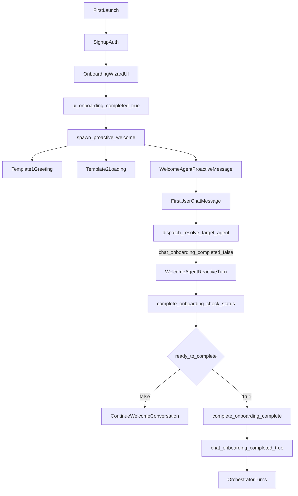

# Issue #563 UX/UI Audit: Onboarding and Welcome Agent

## Executive Summary

The onboarding and welcome-agent system is now technically robust (server-side completion gate, explicit welcome/orchestrator routing, proactive welcome path), but the user experience still has avoidable first-session friction around message sequencing, transition clarity, and activation intent.

The highest-impact opportunities are:
1. reduce duplicate/competing onboarding messages across proactive templates and welcome output,
2. tighten “what to do next” clarity immediately after onboarding completes,
3. make activation outcomes measurable end-to-end (wizard complete -> first chat -> first skill connection -> welcome complete).

## Scope and Method

This audit evaluated:
- first launch and auth handoff into onboarding,
- onboarding overlay and step flow,
- proactive welcome timing and copy contract,
- reactive welcome behavior and completion gate,
- transition into orchestrator/core chat usage.

Key implementation sources reviewed:
- `src/openhuman/agent/agents/welcome/prompt.md`
- `src/openhuman/agent/welcome_proactive.rs`
- `src/openhuman/tools/impl/agent/complete_onboarding.rs`
- `src/openhuman/channels/runtime/dispatch.rs`
- `app/src/components/OnboardingOverlay.tsx`
- `app/src/pages/onboarding/Onboarding.tsx`
- `app/src/pages/onboarding/steps/WelcomeStep.tsx`
- `app/src/pages/onboarding/steps/SkillsStep.tsx`
- `app/src/pages/onboarding/steps/ContextGatheringStep.tsx`

## Current Journey Map

## Prioritized Findings

## P0 (Activation and Trust Risks)

- **P0-1: Message sequencing can feel redundant during proactive welcome**
  - Current behavior: immediate template greeting, fixed-delay loading message, then long LLM welcome.
  - User impact: repeated setup messaging before a clear action can reduce confidence and perceived responsiveness.
  - Recommendation:
    - keep Template 1 short,
    - make Template 2 conditional on slow LLM responses,
    - enforce one clear CTA in the first full welcome response.

- **P0-2: Split onboarding state model is correct technically but opaque experientially**
  - Current behavior: UI onboarding completion and chat onboarding completion are intentionally separate.
  - User impact: can feel like onboarding is “done but not done yet” without explicit framing.
  - Recommendation:
    - add explicit “Setup complete, let’s start” micro-state in chat,
    - instrument transition telemetry to detect confusion points.

- **P0-3: Skill activation is encouraged but not yet treated as a first-class outcome**
  - Current behavior: completion can happen via exchanges without skill connection.
  - User impact: users can finish onboarding without reaching high-value capability quickly.
  - Recommendation:
    - keep current completion gate,
    - add post-completion first-skill nudge and activation metric tracking.

## P1 (Clarity and Consistency)

- **P1-1: Welcome prompt complexity may increase output variance**
  - Recommendation: split policy constraints vs stylistic guidance to reduce model drift.

- **P1-2: Auth/connect failure recovery language is not consistently surfaced**
  - Recommendation: standardize fallback microcopy patterns and troubleshooting links.

- **P1-3: Transition into orchestrator lacks explicit milestone feedback**
  - Recommendation: small completion acknowledgment in first orchestrator-visible UI/message.

## P2 (Polish and Accessibility)

- **P2-1: Terminology drift across onboarding and welcome copy**
  - Recommendation: adopt a canonical vocabulary for connect/auth/integrate states.

- **P2-2: Onboarding accessibility pass not yet codified**
  - Recommendation: run focused keyboard/screen reader audit on overlay and step controls.

## UX/UI Improvement Plan

## Quick Wins (1-3 days)

- Make proactive Template 2 conditional on LLM latency threshold.
- Enforce “single next best action” sentence in first full welcome output.
- Add transition telemetry events and baseline dashboard.
- Standardize fallback copy for failed/uncertain auth or connection outcomes.

## Medium Scope (3-7 days)

- Refactor welcome prompt into policy section + style section.
- Add post-welcome non-blocking first-skill reminder when no skill is connected.
- Add explicit completion confirmation treatment in chat.

## Deeper Redesign (1-2 sprints)

- Introduce explicit first-session read-state model shared between frontend and core.
- Build scripted onboarding QA harness for proactive + reactive variants.

## Suggested Success Metrics

- `onboarding_wizard_completed_rate`
- `wizard_complete_to_first_chat_seconds_p50_p90`
- `proactive_welcome_delivery_rate`
- `welcome_completion_rate`
- `first_skill_connected_before_welcome_complete_rate`
- `first_skill_connected_within_24h_rate`
- `auth_link_click_to_success_rate_by_toolkit`
- `day1_return_rate_after_welcome_completion`

## Recommended Implementation Sequence

1. Instrument transition events and baseline funnel dashboard.
2. Ship proactive Template 2 conditional emission.
3. Tighten welcome response policy for single clear next action.
4. Add post-completion first-skill reminder path.
5. Perform copy consistency and accessibility pass on onboarding surfaces.
6. Re-measure and decide whether deeper state-model redesign is needed.

## Stakeholder-Ready Summary

The onboarding and welcome system is technically stable and guarded, but activation UX can still improve materially. Priority is to reduce redundant first-session messaging, make transitions explicit, and optimize for first-skill connection with measurable outcomes. These are mostly incremental changes with high impact, and should be executed before considering larger architectural redesign.
